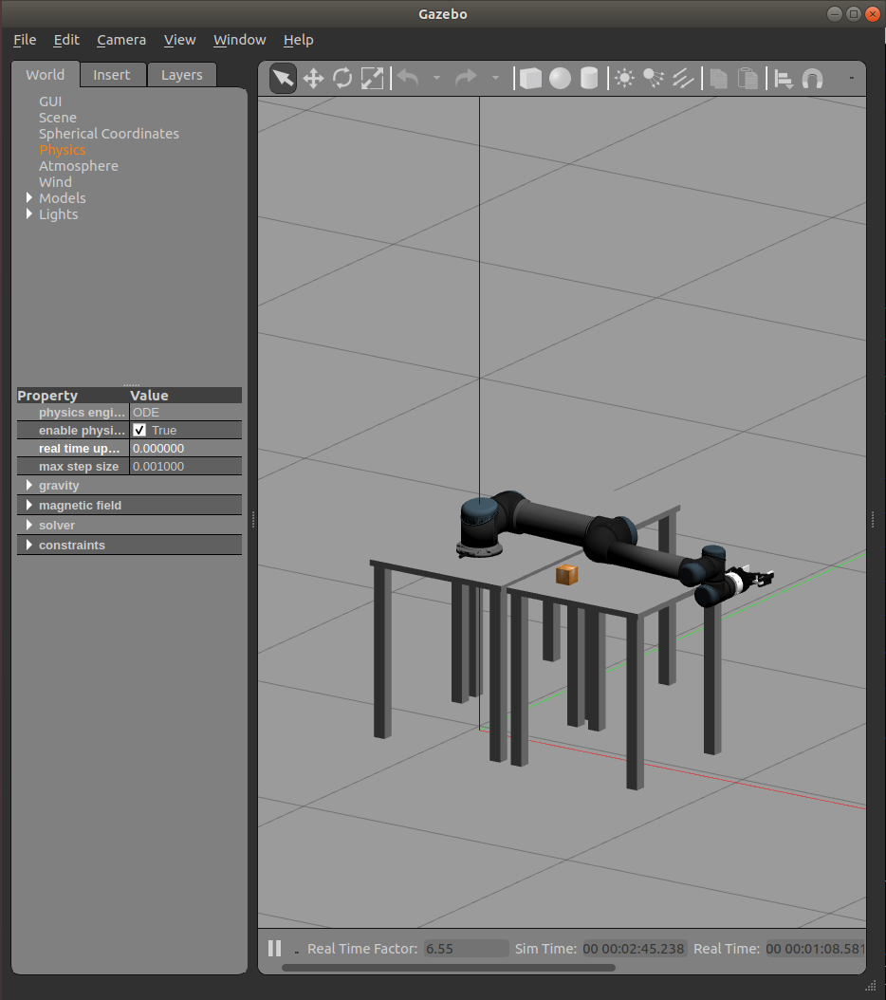

# ur5_reaching_drl

## Tested in:
Ubuntu 18.04 with Melodic

Python 3.9.16

## Requires:

fmauch_universal_robot: https://drive.google.com/file/d/1Ixj56-pdjBRu6IUY1tKanvHW4tJ0S_0O/view?usp=sharing

Pytorch: Install in conda environment using: 

`conda install pytorch torchvision -c pytorch`

or pip:

pip install torch torchvision

Tensorboard: https://pytorch.org/tutorials/recipes/recipes/tensorboard_with_pytorch.html

Robotics Toolbox for Python: https://github.com/petercorke/robotics-toolbox-python

## Simulation world launch:

`roslaunch ur5_reaching_drl ur5_cubes.launch`

In the gazebo world set the "real time update rate" under the "Physics" tab. Check the image:

This allows the simulation to run as fast as possible.

In a separate terminal send the following command:

`rostopic pub -1 /arm_controller/command trajectory_msgs/JointTrajectory '{joint_names:["ur5_arm_shoulder_pan_joint","ur5_arm_shoulder_lift_joint","ur5_arm_elbow_joint","ur5_arm_wrist_1_joint","ur5_arm_wrist_2_joint","ur5_arm_wrist_3_joint"], points:[{positions:[0.0,-1.57,1.57,-1.57,-1.57,1.57],velocities:[0,0,0,0,0,0],time_from_start:[3,0]}]}'`

The above command is included in reset() of the robot-task environment "ur5_reaching.py", but sometimes the IK/FK solver gives a weird configuration. So to avoid that we can set the desired configuration before running the training script.

## Start Training:

Navigate to the td3.py training script directory:

`cd ~/{catkin_ws}/src/ur5_reaching_drl/src/scripts`

Open "td3.py" script in ur5_reaching_drl/src/scripts and set "train = True" and comment "train = False". This will make the script run in training mode.

Run the script:

`python td3.py`

Once the training is completed, we can now uncomment "train = False" and comment "train = True". This will make the script run in testing mode, where you can see the trained model working in gazebo. The saved Neural network model is stored in ur5_reaching_drl/src/scripts/model

We use tensorboard to visualize the training results. The run data is stored in ur5_reaching_drl/src/scripts/runs. In a new terminal navigate to "scripts" directory:

`cd ~/{catkin_ws}/src/ur5_reaching_drl/src/scripts`

`tensorboard --logdir=runs`

In the terminal you will get a link to visualize the runs in tensorboard.

In the td3.py we set manual seeds for reproducibility. Change the seed values which will give different results which can be combined later to see the covariance.
Once multiple runs with different seed values have been completed, download the data (in .csv format) of each run from tensorboard. Open tensorbaord, go to "Scalars" tab and select all the runs you want to compare. You will multiple graphs, download the ones you are interested in and store it in ur5_reaching_drl/src/scripts/data as .csv file. In the "data" directory, make changes in 'combine_plot.py' to include all the saved .csv files and run the script to get a covariance plot.

